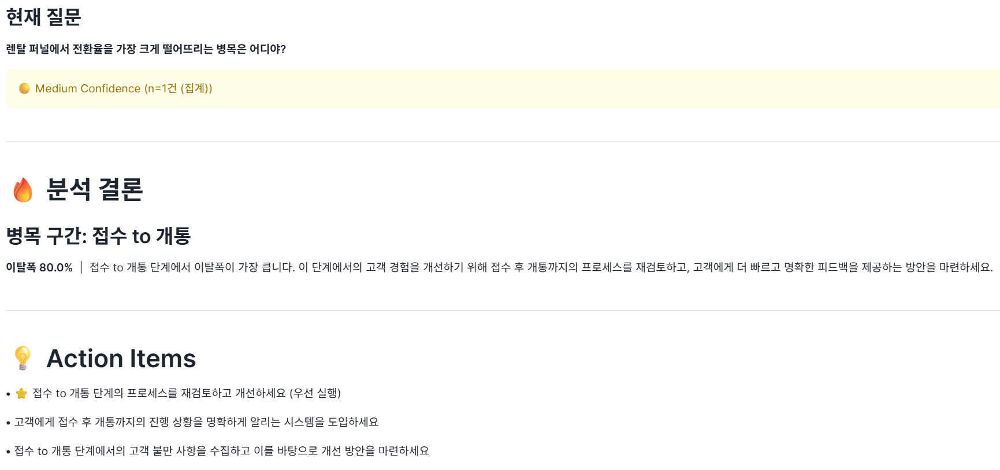
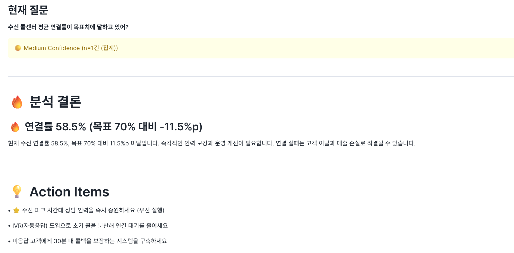
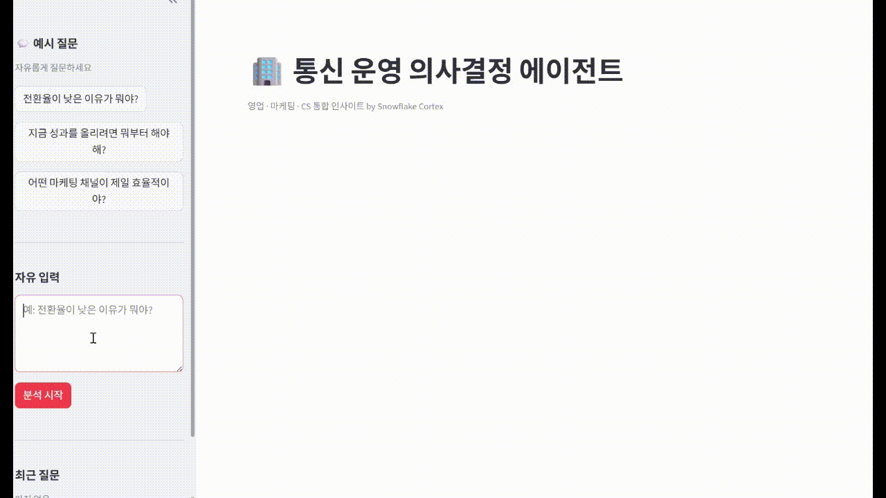

# 🏢 통신 운영 의사결정 AI 에이전트

## 🧠 AI가 마케팅 예산을 직접 결정합니다

173개 채널 중 어디에 돈을 써야 하는지 자동으로 선택하는 AI

> 마케팅 / 영업 / CS 데이터를 통합해 하나의 의사결정을 내리는 AI

> 단순 분석이 아니라, 여러 데이터를 종합해 **무엇을 먼저 해야 하는지 결정하는 AI 에이전트**

> Top-1 Accuracy 33%, Hallucination 0%,  

🌐 **There is an English version of this README:** [README_ENG.md](./README_ENG.md)

---

## ❗ Problem

렌탈/통신 업체의 마케팅·영업·CS 부서는 **각각 따로 데이터를 보고 의사결정**합니다.

```
마케팅팀  →  GA4 채널 성과만 봄
영업팀    →  지역별 계약 수만 봄
CS팀      →  콜센터 연결률만 봄
```

이 단절이 만드는 문제:

- 마케팅 예산을 잘못된 채널에 낭비
- CS 인력 과소/과다 배치로 고객 이탈
- 퍼널 병목을 몰라서 계약 전환율 감소
- **→ 실제 매출 손실로 이어짐**

---

## 🖥️ Demo UI

👉 아래는 실제 의사결정 결과 예시입니다.

3개의 질문만으로 마케팅, 퍼널, CS 전 영역의 의사결정을 수행합니다.

### 1) Marketing Decision

최적 채널 추천 + 액션 자동 생성


### 2) Funnel Bottleneck Detection

퍼널 병목 자동 탐지



### 3) CS Optimization Insight

CS 운영 최적화 인사이트


> **Demo UI = Interface** / **agent_v2.py = Brain**
>
> Snowflake Demo UI는 안정적인 시연을 위해 검증된 SQL 기반으로 구성된 인터페이스입니다.
> 실제 핵심 의사결정 로직은 `agent_v2.py`에서 수행되며,
> 멀티 도메인 reasoning을 통해 더 복잡한 의사결정을 처리합니다.

---

## 🎯 Example Insight

**질문:** "어떤 마케팅 채널이 제일 효율적이야?"

**결과:**

```
최적 채널: nc_money / direct_ps
CVR:       27.1%
전체 평균 대비: +289.8%
173개 채널 중: 상위권 (Top-3)
매출 기여:  30,651,037원 / 872세션
```

**인사이트:**

- direct 유입 특성상 고의도 고객 비중이 높아 CVR이 높게 나타남
- CVR + 매출 기여도를 동시에 고려한 복합 분석 결과

**Action:**

- 해당 채널 예산 20~30% 확대 A/B 테스트 진행
- 유사한 direct 기반 채널 발굴 및 확장
- 퍼널 접수→개통 단계 이탈 원인 분석

👉 그렇다면 이 의사결정은 어떻게 만들어질까?

---

## 🧠 Advanced Decision Engine (`agent_v2.py`)

본 프로젝트의 핵심은 단순 질의응답이 아닌, **멀티 도메인 의사결정 에이전트**입니다.

```
Demo UI (Stable Layer)          agent_v2.py (Decision Engine)
──────────────────────    vs    ──────────────────────────────
검증된 3개 시나리오              자연어 질문 → 자유 분석
단일 도메인 응답                 마케팅 + 퍼널 + CS 동시 분석
SQL 하드코딩                    Cortex Analyst 동적 SQL 생성
안정성 최우선                    의사결정 품질 최우선
```

`agent_v2.py`가 수행하는 것:

- **멀티 도메인 동시 분석** — 마케팅 / 퍼널 / CS 데이터를 한 번에
- **Conflict Detection** — "유입은 양호하나 전환에서 손실" 자동 감지
- **영향도 기반 우선순위** — 1순위부터 3순위까지 자동 결정
- **즉시 실행 가능한 액션** — 구체적 대응 방안 자동 생성

---

### 🧠 Multi-Domain Decision Example

**질문:**

> 지금 성과를 올리려면 뭐부터 해야 해?



**결과:**

```
1순위: 퍼널 병목 개선 (상담요청 CVR 29.4% → 직접 원인)
2순위: 고효율 채널 예산 확대 (nc_money +290% → 성장 기회)
3순위: CS 특정 시간대 모니터링 (연결률 94% → 유지)
```

> `agent_v2.py`는 마케팅 / 퍼널 / CS 데이터를 동시에 분석하여
> 직접 원인, 간접 원인, 실행 우선순위를 함께 도출합니다.

---

## 📈 Impact


|         | 기존 방식     | AI 에이전트         |
| ------- | --------- | --------------- |
| 데이터 통합  | 부서별 분리    | 마케팅+영업+CS 통합    |
| 의사결정 시간 | 수 시간      | 수 분             |
| 채널 비교   | 담당자 경험 의존 | 173개 전체 정량 비교   |
| 액션 도출   | 회의 후 결정   | 즉시 실행 가능한 액션 제공 |


→ **빠른 예산 재배분 → 매출 최적화**

---

## ⚠️ Baseline vs Ours

**LLM Only 방식:**

```
가장 높은 CVR 채널 선택
→ tips_capsule (CVR 34.7%, 세션 1,031건)
→ 트래픽/매출 고려 없음 → 잘못된 추천
```

**Our System:**

```
CVR 40% + Revenue per Session 60% 복합 score
→ nc_money/direct_ps (CVR 27.1%, 세션 872건)
→ 실제 매출 기여도 반영 → 올바른 추천
```

> Rule-based grounding으로 LLM 환각을 제거하고 실제 데이터 기반으로 보정

> → 해당 차이는 실제 평가에서도 확인되며, CVR-only baseline 대비 더 높은 추천 정확도를 보였습니다.

---

## 📊 Evaluation (KPI 기반 검증)

본 프로젝트는 단순 데모가 아니라, 추천 정확도 / 숫자 신뢰도 / 비즈니스 임팩트 기준으로 시스템을 정량적으로 검증했습니다.

### 평가 기준


| 항목                          | 지표                                  | 의미                          |
| --------------------------- | ----------------------------------- | --------------------------- |
| **Recommendation Accuracy** | Top-1 / Top-3 Accuracy              | AI가 실제 최적 채널을 맞게 선택했는가      |
| **Numeric Grounding**       | Hallucination Rate (threshold: 2%p) | LLM이 생성한 수치가 실제 데이터와 일치하는가  |
| **Business Impact**         | CVR Uplift / Revenue Uplift         | 추천 채널이 전체 평균 대비 얼마나 높은 성과인가 |


### 결과 요약


| Metric             | Result                    |
| ------------------ | ------------------------- |
| Top-1 Accuracy     | 33% (1/3 케이스)             |
| Top-3 Accuracy     | 67% (2/3 케이스)             |
| Hallucination Rate | **0%** (임계값 2%p 기준)       |
| CVR Uplift         | **3.9x** (추천 채널 vs 전체 평균) |
| Revenue Uplift     | **4.4x**                  |


### Baseline 비교


| Method         | Top-1 Accuracy | 비고                     |
| -------------- | -------------- | ---------------------- |
| Random 추천      | ~1%            | 무작위 선택                 |
| CVR Only       | **0%**         | 소규모 채널 과대평가 문제         |
| **Our System** | **33%**        | CVR + Revenue 복합 score |


> 단순 CVR 기준 선택은 low-volume 채널을 과대평가하는 문제를 보였으며,
> 본 시스템은 Revenue를 함께 고려해 더 안정적인 추천을 제공합니다.

> ⚠️ 본 평가는 오프라인 데이터 기반이며 실제 매출 증가를 보장하지 않습니다.

---

## 🎬 Demo Flow

```
1. 자연어 질문 입력
   "어떤 마케팅 채널이 제일 효율적이야?"
        ↓
2. Cortex Analyst → SQL 자동 생성 / 데모에서는 검증된 SQL 사용
   (173개 채널 전체 조회)
        ↓
3. Snowpark → 실제 데이터 조회
   (2,621건 실시간 분석)
        ↓
4. Rule Engine → 정량 분석
   CVR + Revenue 복합 score 계산
   전체 평균 대비 순위 산출
        ↓
5. Cortex Complete → 인사이트 생성
   채널 특성 인과 설명
   구체적 액션 3개 제공
        ↓
6. Streamlit → 의사결정 UI 출력
```

---

## 🧠 Core Reasoning Stack

본 프로젝트는 V01/V03/V07/V09/V10 뷰를 기반으로
YAML 형태의 Semantic View를 정의하여 Cortex Analyst가
도메인 의미를 이해하고 SQL을 생성할 수 있도록 구성했습니다.

특히 로컬의 `agent_v2.py`는 단일 질의 응답기가 아니라,
마케팅 / 퍼널 / CS / 영업 데이터를 동시에 해석해

- **직접 원인** — 데이터로 확인된 병목
- **간접 원인** — 도메인 간 연관 추론
- **우선순위** — 영향도/긴급도/난이도 기반 1~3순위
- **실행 액션** — 즉시 실행 가능한 구체적 대응

을 함께 도출하는 멀티 도메인 의사결정 에이전트입니다.

Snowflake Streamlit 데모에서는 시연 안정성을 위해
검증된 SQL 시나리오를 사용했지만,
전체 시스템은 Cortex Analyst 기반 자유 질의 확장을 전제로 설계되었습니다.

---

## 🏗️ Architecture

### 1) Stable Demo Layer (Snowflake Streamlit)

```
Verified Questions (3개 시나리오)
        ↓
Cortex Analyst → Verified SQL
        ↓
Snowpark 실행
        ↓
Rule Engine (CVR + Revenue 복합 분석)
        ↓
Cortex Complete → 인사이트 생성
        ↓
Streamlit in Snowflake UI
```

### 2) Advanced Reasoning Layer (Local `agent_v2.py`)

```
Natural Language Question
        ↓
Decision Type Classification (root_cause / priority / budget / ops)
        ↓
Multi-Domain Evidence Extraction (마케팅 + 퍼널 + CS 병렬 분석)
        ↓
Conflict Detection (도메인 간 신호 충돌 감지)
        ↓
Priority Ranking (영향도 / 긴급도 / 난이도)
        ↓
Cortex Complete Synthesis
        ↓
Final Decision Output (직접원인 / 간접원인 / 우선순위 / 액션)
```

---

## ❄️ Why Snowflake Cortex?


| 기능                         | 역할                  |
| -------------------------- | ------------------- |
| **Cortex Analyst**         | 자연어 질문 → SQL 자동 생성  |
| **Cortex Complete**        | 데이터 기반 인사이트 + 액션 생성 |
| **Snowpark**               | 대규모 데이터 실시간 조회      |
| **Streamlit in Snowflake** | 플랫폼 내 완결된 UI        |


→ **단순 LLM이 아닌 "Snowflake 위에서 완결되는 데이터 AI 시스템"**

---

## 💡 Why This Is Different

- 단순 추천 ❌ → **173개 채널 전체 대비 순위 기반 의사결정** ✅
- 단순 LLM ❌ → **Rule-based grounding으로 hallucination 제거** ✅
- 단순 분석 ❌ → **즉시 실행 가능한 Action 3개 자동 제공** ✅
- 단일 부서 ❌ → **마케팅 + 영업 + CS 통합 분석** ✅
- 단순 데모 ❌ → **정량적 평가 기반 검증된 시스템** ✅

---

## 💰 Why It Matters

잘못된 채널에 예산을 쓰면:

- 광고비 낭비 (CVR 낮은 채널에 집중)
- 전환율 감소 (퍼널 병목 방치)
- 고객 이탈 (CS 연결률 미달)

**이 시스템은:**

- 고의도 고객 채널 자동 식별
- ROI 기반 예산 재배분 제안
- 매출 극대화 의사결정 지원

---

## 🔥 핵심 인사이트 (EDA)


| 도메인    | 발견                          | 임팩트              |
| ------ | --------------------------- | ---------------- |
| 📊 마케팅 | 채널별 CVR **최대 4,000배 격차**    | 예산 재배분으로 즉시 효과   |
| ⚠️ 퍼널  | **"접수→개통" 단계** 최대 이탈 병목     | 프로세스 개선으로 전환율 향상 |
| 📞 CS  | 수신 연결률 **55.8%**, 목표 70% 미달 | 인력 배치 최적화 필요     |


---

## 🤖 에이전트 파이프라인 (`agent_v2.py`)

```python
run_agent(질문)
  → parse_intent()              # 의사결정 유형 분류
                                #   root_cause / priority / budget / ops / regional
  → call_cortex_analyst()       # 도메인별 개별 SQL 자동 생성
      marketing → V07 채널 분석
      funnel    → V03 퍼널 분석
      cs        → V10 시간대 분석

  → extract_*_evidence()        # 도메인별 structured evidence 추출
      marketing_evidence → best_channel, cvr, rank, signal
      funnel_evidence    → bottleneck_stage, dropoff, signal
      cs_evidence        → connection_rate, peak_time, signal

  → detect_conflicts()          # 도메인 간 신호 충돌 감지
      "마케팅 🟢 + 퍼널 🔴 → 유입 양호, 전환 손실"

  → prioritize_actions()        # 영향도/긴급도/난이도 기반 우선순위
      1순위: 퍼널 병목
      2순위: 마케팅 예산 확대
      3순위: CS 최적화

  → cortex_complete()           # LLM 최종 synthesis
  → parse_json()                # 직접원인 / 간접원인 / 액션 구조화
```

---

## 📂 파일 구조

```
telecom-ops-agent/
├── eda_final.ipynb        # 데이터 탐색 및 핵심 인사이트 도출
├── semantic_model.yaml    # Cortex Analyst Semantic View 정의 (뷰 5개)
├── agent.py               # 로컬 기본형 Analyst + Complete 파이프라인
├── agent_v2.py            # 멀티 도메인 의사결정 에이전트 ★
│                          #   (reasoning / conflict detection / priority ranking)
├── streamlit_app.py       # 로컬 Streamlit (agent_v2 연결)
├── snowflake_app.py       # Streamlit in Snowflake 데모 앱 (검증 시나리오)
├── eval.py                # KPI 기반 시스템 평가 (Accuracy / Hallucination / Uplift)
└── README.md
```

---

## 🛠️ Tech Stack

- **Snowflake Cortex Analyst** — 자연어 → SQL 자동 생성
- **Snowflake Cortex Complete** — mistral-large2 인사이트 생성
- **Streamlit in Snowflake** — 통합 운영 대시보드
- **Python / Snowpark** — Rule-based 판단 엔진

---

## 📊 데이터셋

**아정당 — 한국 통신 구독·계약 분석 데이터** (Snowflake Marketplace)


| 뷰   | 설명             | 활용        |
| --- | -------------- | --------- |
| V01 | 월별·지역별 계약 통계   | 영업 트렌드 분석 |
| V03 | 계약 퍼널 단계별 전환율  | 병목 탐지     |
| V07 | GA4 마케팅 채널별 성과 | 채널 최적화    |
| V09 | 월별 콜센터 통계      | CS 성과 추적  |
| V10 | 시간대별 콜 분포      | 인력 배치 최적화 |


---

## 🚀 실행 방법

### 로컬

```bash
pip install -r requirements.txt
streamlit run streamlit_app.py
```

### Snowflake Streamlit

```
Snowsight → Projects → Streamlit → New App
snowflake_app.py 내용 붙여넣기 → Run
```

---

## 🎤 Verified Demo Scenarios

- "어떤 마케팅 채널이 제일 효율적이야?"
- "렌탈 퍼널에서 전환율을 가장 크게 떨어뜨리는 병목은 어디야?"
- "콜센터 연결률이 가장 낮은 시간대는 언제고, 어떻게 개선해야 해?"

> 위 3개 시나리오는 Snowflake Streamlit 데모에서 안정적으로 재현 가능한 검증 질문입니다.

---

## 🧪 Demo Setup

로컬 개발 환경에서는 YAML 기반 Semantic View를 구성하고,
`agent_v2.py`를 통해 멀티 도메인 reasoning 흐름을 검증했습니다.

반면 Snowflake Streamlit 데모 환경에서는
시연 안정성과 재현성을 위해 검증된 SQL 시나리오를 사용했습니다.

즉, **데모 앱은 안정성을 위한 제품 인터페이스**이고,
`**agent_v2.py`는 프로젝트의 핵심 의사결정 로직을 담은 고급 에이전트**입니다.

---

## 🚀 현재 구현 + 확장 방향

**이미 구현된 것 (`agent_v2.py`)**

- 멀티 도메인 동시 분석 (마케팅 + 퍼널 + CS)
- 의사결정 유형 자동 분류
- Conflict Detection 및 도메인 간 연관 추론
- 영향도/긴급도 기반 우선순위화

**확장 가능한 것**

- Cortex ML Forecast 결합 → "다음 달 무엇을 준비해야 하는가"까지 제안
- 지역 단위 의사결정 → 강남구, 송파구 등 지역 맞춤형 액션
- 운영 자동화 → 추천 결과를 알림/리포트 형태로 자동 배포

---

## 🔒 Data Usage Notice

본 저장소에는 해커톤 제공 원천 데이터가 포함되어 있지 않습니다.
코드와 아키텍처만 공개하며, 실제 데이터는 해커톤 규정에 따라 외부 공유하지 않습니다.

---

## 📅 개발 기간

2026년 4월 | Snowflake Hackathon 2026
